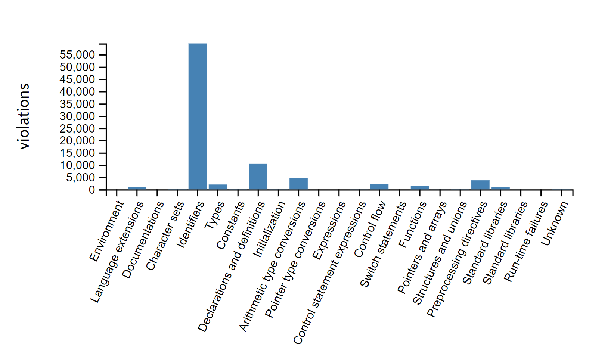

# barchart
This project visualizes a csv file in a barchart. 

# usage
1. Put the csv file in the same directory as the html file.
1. Start a web server: `python -m http.server 8000`
1. In your browser goto `localhost:8000`

# example output

